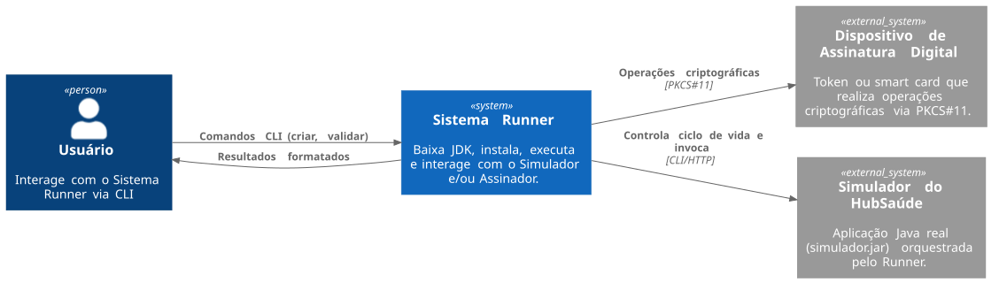
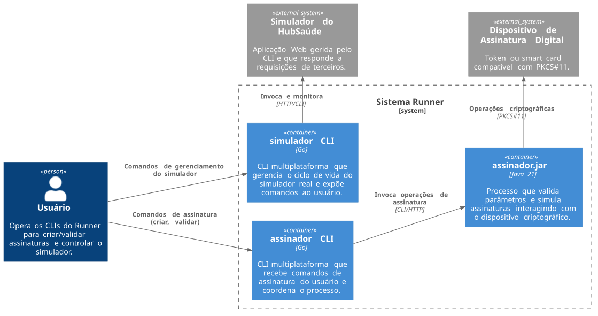

# Sistema Runner — Design

- O registro do design é organizado conforme o modelo C4. Consulte [C4 Model](https://c4model.com/) para detalhes.
- Diagramas empregam o PlantUML. Consulte [PlantUML](https://plantuml.com/) para detalhes.
- Scripts (`geraimagens.sh` e `geraimagens.bat`) automatizam a geração de diagramas a partir dos arquivos `.puml`.

## 1. Diagrama de Contexto



**Atores e Sistemas Externos:**

| Elemento | Tipo | Descrição |
|----------|------|-----------|
| Usuário | Ator | Pessoa que interage com o sistema via linha de comandos |
| Dispositivo de Assinatura Digital | Sistema Externo | Hardware criptográfico (token USB, smart card) que armazena certificados e executa operações de assinatura |
| Simulador do HubSaúde | Sistema Externo | Aplicação Web gerida pelo CLI e que responde a requisições de terceiros |

## 2. Diagrama de Contêineres



**Comunicação entre contêineres:**

| Origem | Destino | Protocolo | Descrição |
|--------|---------|-----------|-----------|
| Usuário | assinatura | CLI | Comandos de assinatura (criar, validar) digitados no terminal |
| Usuário | simulador | CLI | Comandos de gerenciamento do simulador |
| assinatura | assinador.jar | CLI / HTTP | Invocação direta ou requisição HTTP (conforme modo de execução) |
| assinador.jar | Dispositivo Criptográfico | PKCS#11 | Interface padrão para comunicação com tokens e smart cards |
| simulador | Simulador do HubSaúde | HTTP | Invoca e monitora o ciclo de vida do simulador |

## 3. Decisões Tecnológicas

| Componente | Tecnologia | Justificativa |
|------------|------------|---------------|
| CLI `assinatura` | Go 1.22+ | Cross-compiling nativo, stdlib rica para CLI e processos |
| CLI `simulador` | Go 1.22+ | Idem |
| `assinador.jar` | Java 21 | Restrição de projeto; necessário para PKCS#11 via SunPKCS11 |
| Estado local | Arquivo JSON em `~/.hubsaude/` | Simples, sem dependências extras |

## 4. Dinâmica de Fluxos

### 4.1. Invocação Direta (Modo Local / Cold Start)

Ideal para execuções esporádicas ou scripts de automação.

```
1. Usuário executa: assinatura sign --local ...
2. CLI valida superficialmente os parâmetros
3. CLI executa: ~/.hubsaude/jdk/bin/java -jar assinador.jar --modo=local [params]
4. assinador.jar inicia (cold start), valida, retorna JSON no stdout e encerra
5. CLI captura stdout, formata e apresenta ao usuário
```

### 4.2. Invocação via Servidor (Modo HTTP / Warm Start)

Ideal para múltiplas requisições sequenciais (menor latência).

```
1. Usuário executa: assinatura sign ...
2. CLI verifica ~/.hubsaude/ para instância registrada
   - Se não estiver rodando: inicia assinador.jar em background e registra PID
3. CLI envia POST http://localhost:<porta>/sign com parâmetros em JSON
4. assinador.jar valida e retorna 200 OK (sucesso) ou 400 Bad Request (erro)
5. CLI recebe JSON, formata e apresenta ao usuário
```

## 5. Contrato de Comunicação

Todo retorno do `assinador.jar` (stdout ou HTTP) segue o esquema JSON abaixo.

### Sucesso

```json
{
  "status": "success",
  "operation": "sign",
  "data": {
    "signature": "MIIB...[base64 simulado]...",
    "algorithm": "SHA256withRSA"
  }
}
```

### Erro

```json
{
  "status": "error",
  "error_code": "ERR_INVALID_PARAM",
  "message": "A chave privada fornecida é inválida ou o dispositivo não foi encontrado.",
  "details": ["O parâmetro --pin possui tamanho incorreto (deve ter no mínimo 4 dígitos)"]
}
```

## 6. Análise de Riscos

| Risco Técnico | Impacto | Estratégia de Mitigação |
|---------------|---------|-------------------------|
| Provisionamento automático do JDK | Alto (bloqueia uso do CLI) | Abstrações em Go para baixar `.tar.gz`/`.zip` do Adoptium/Eclipse Temurin para `~/.hubsaude/jdk` |
| Gerenciamento de processos (Start/Stop/PID) | Alto (processos zumbis, portas presas) | Arquivo de estado JSON em `~/.hubsaude/` com PID e porta |
| Assinatura de artefatos com Cosign/Sigstore | Médio (pode travar entrega contínua) | Step isolado e automatizado no GitHub Actions com identidade OIDC |
| Cross-compiling multiplataforma | Baixo | Go oferece cross-compiling nativo |

## 7. Como gerar os diagramas

Os arquivos-fonte dos diagramas ficam em `diagramas/` e as imagens geradas em `diagramas/imagens/`.

### Linux / macOS

```bash
# Dar permissão de execução (necessário apenas na primeira vez)
chmod +x geraimagens.sh

# Gerar todos os diagramas
./geraimagens.sh
```

### Windows

```bat
geraimagens.bat
```

Os scripts fazem o download automático do `plantuml.jar` se ele não estiver disponível localmente.
